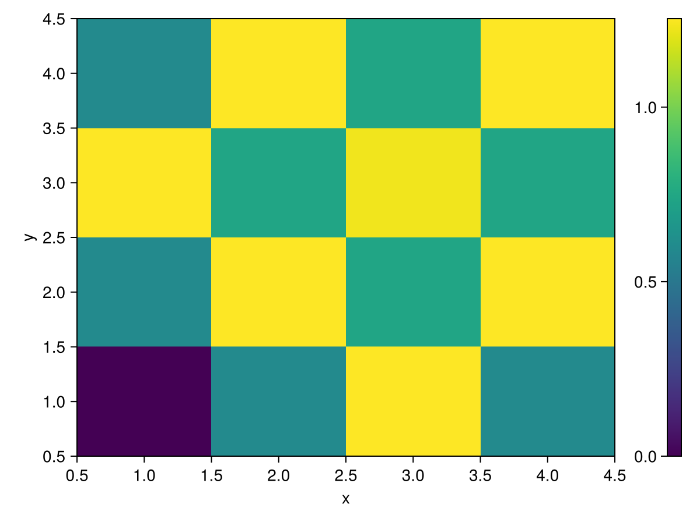

# Charge order in the attractive Hubbard model

**Author** Hannes Karlsson

It is well known that the attractive Hubbard model at half-filling display a ground state with a $(\pi,\pi)$ charge density wave, where doublons order in a checker board pattern. Here we show this by computing the density-density charge correlator $\langle n_i n_j \rangle$ on a $4\times 4$ lattice. We do this by first computing the ground state using 'eig0', then constructing the operator $O_{ij}=\hat{n}_i \hat{n}_j$ and taking the inner product.

{ align=center }


=== "C++"
	```c++
	--8<-- "examples/ahm_correlations/main.cpp"
	```

=== "Julia"
	```julia
	--8<-- "examples/ahm_correlations/main.jl"
	```
	
