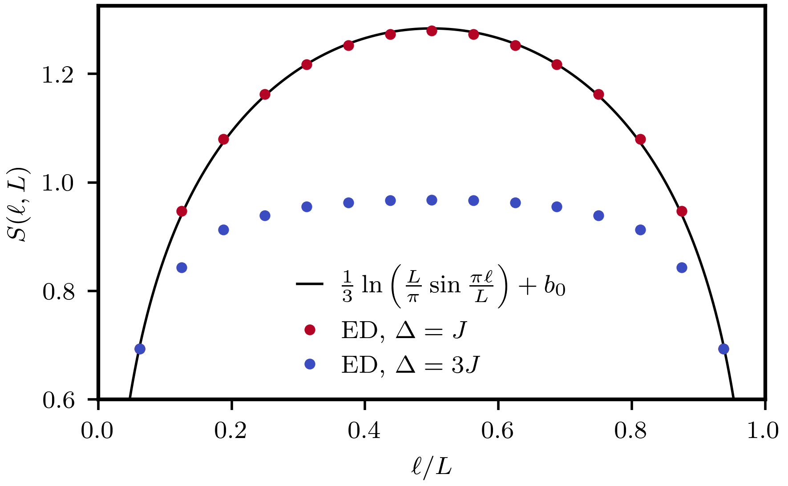

# Entanglement Entropy Ground-State XXZ

In this example, we compute the entanglement entropy[[1]](#1) of the ground state of the spin $-\frac{1}{2}$ XXZ chain, described by the Hamiltonian:
$$
\mathcal{H} = J \sum_{n=0}^{N-1} \left(S^x_n\cdot S^x_{n+1} + S^y_n\cdot S^y_{n+1} + \Delta S^z_n\cdot S^z_{n+1}\right). 
$$

The algorithm follows these steps:

1. Obtain the ground state using the Lanczos algorithm.

2. Construct the reduced density matrix for the region with the firs $\ell$ spins by tracing out the complementary degrees of freedom:

$$
\rho_{\ell} = \text{Tr}_{\bar{\ell}} \left(|\text{GS}\rangle \langle\text{GS}| \right).
$$ 

3. Compute the entanglement entropy from the reduced density matrix:

$$
S_\ell = -\text{Tr}\left( \rho_\ell \ln \rho_\ell  \right),
$$

which is done by diagonalizing $\rho_\ell$.

{ align=center }

As shown in the Figure above, the entanglement entropy of the XXZ chain ground state for two distinct values of $\Delta$. In the critical phase, when  $\Delta \in (-J,J)$ [[1]](#1), the entanglement entropy follows a logarithmic scaling with the subsystem size, as predicted by (1+1)-dimensional conformal field theory. Specifically, we extract the central charge, $c$, by fitting the entanglement entropy to the expression derived for a finite system[[2]](#2):
$$
S_{\text{CFT}}\left(\ell,L \right) = \dfrac{c}{3} \ln \left( \dfrac{L}{\pi} \sin\left(\frac{\pi\ell}{L}\right)\right) + b_0,
$$
where $L$ is the total size of the system and $b_0$ is a constant. Away from this regime the system is in gapped phase, the system is in a gapped phase, where the entanglement entropy does not depend on the subsystem size for $1\ll\ell\ll L$,i.e, it follows the area-law behaviour.

=== "C++"
	```c++
	--8<-- "examples/entanglement_ground_state/main.cpp"
	```

=== "Julia"
	```julia
	--8<-- "examples/entanglement_ground_state/main.jl"
	```
	
## references
<a id="1" href="https://www.sciencedirect.com/science/article/pii/S0370157316301582?ref=cra_js_challenge&fr=RR-1">[1]</a>
Laflorencie, Nicolas, Quantum entanglement in condensed matter systems, Physics Reports 646, 1-59 (2016)

<a id="2" href="https://iopscience.iop.org/article/10.1088/1751-8113/42/50/504005">[2]</a>
Calabrese, Pasquale and Cardy, John, Entanglement entropy and conformal field theory, Journal of Physics A: Mathematical and Theoretical  42,50 (2009) 
