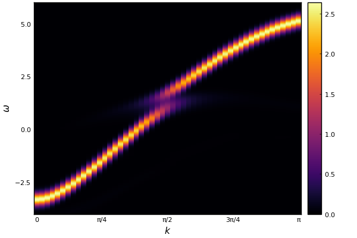

# Hubbard model Green's function

**Author** Martin Ulaga

Uses the [Lanczos algorithm](../documentation/algorithms/eigvals_lanczos.md)[[1]](#1) to calculate the Green's function of the Hubbard model. See also the documentation page for the [spin structure factor](spinhalf_chain_structure_factor.md). The Green's function is given by

$$
    G({\bf k}, \omega)=-i\int dt e^{-i\omega t}\langle \lbrace c_{\bf k}(t),c^{\dagger}_{\bf k}\rbrace\rangle.
$$

To achieve a mesh of momentum space, we can use either use the generated momenta inside the Wigner-Seitz cell allowed by the finite cluster or twisted boundary conditions[[2]](#2)[[3]](#3), where the lattice ${\bf k}$-point is shifted to ${\bf k + \boldsymbol{\theta}}$ by introducing a flux via Peierls substitution in the Hamiltonian, $t_{ij} \rightarrow t_{ij}\exp(i{\bf \boldsymbol{\theta}\cdot r}_{ij})$. For this example, we're calculating the spectral function along the cut $\Gamma$-$M$, i.e., the diagonal of the reciprocal lattice unit cell. There is no guarantee that the recovered spectral function is indicative of properties of the infinite system (but can be ``closer'' in the sense that any reasonable interpolation between the $k$-points of the finite cluster is an improvement).

{ align=center }
	
## Example code

=== "Julia"

    ```julia
        --8<-- "examples/hubbard_greens_f/main.jl"
    ```

=== "C++"

    ```c++
        --8<-- "examples/hubbard_greens_f/main.cpp"
    ```

## References
<a id="1">[1]</a> 
Prelovšek, P., & Bonča, J. (2013). Ground state and finite temperature Lanczos methods. Strongly Correlated Systems: Numerical Methods, 1-30.

<a id="2">[2]</a>
Tohyama, T. (2004). Asymmetry of the electronic states in hole-and electron-doped cuprates: Exact diagonalization study of the $t-t′-t ″-J$ model. Phys. Rev. B, 70(17), 174517

<a id="3">[3]</a>
Poilblanc, D. (1991). Twisted boundary conditions in cluster calculations of the optical conductivity in two-dimensional lattice models. Physical Review B, 44(17), 9562.
