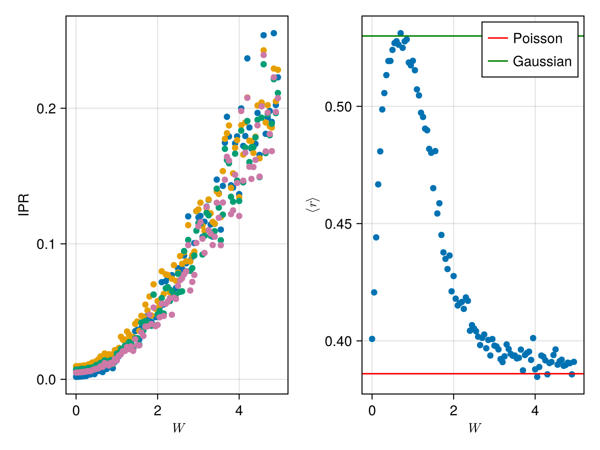

# Level statistics in many-body localized systems

**Author** Hannes Karlsson

The Hamiltonian for the Ising model with an applied magnetic field in $z$-direction
$$
    H = -J\sum_i \sigma^z_i \sigma^z_{i+1} - h\sum_i \sigma_i^z
$$
commutes with all operators $\sigma_i^z$, which constitutes an extensive set of conserved quantitues, and so the system is integrable. If one however adds a magnetic field in the $x$-direction
$$
    H = -J\sum_i \sigma^z_i \sigma^z_{i+1} - \sum_i (h\sigma_i^z + \gamma\sigma_i^x),
$$
the model becomes ergodic. It is thus expected to follow the predictions of *random matrix theory* and the *eigenstate thermalization hypothesis*. Consider now the same Hamiltonian but with random interaction and field strengths.
$$
    H = \sum_i J_i \sigma^z_i \sigma^z_{i+1} - \sum_i (h_i\sigma_i^z + \gamma_i\sigma_i^x),
$$
where, for the sake of concreteness, we take $J_i\in [0.8,1.2]$, $h_i\in [-W,W]$, $\gamma_i=1$, and $W$ is the disorder strength. This model is known to display many-body localisation for large enough $W$, i.e, it hosts an extensive set of emergent (local)
conserved quantities, often called l-bits. To study this, we compute the inverse participation ration, IPR$=\sum_i |\psi_i|^4$, most often used to study Anderson localisation, for some of the low lying eigenstates. In a perfectly localised state, one would expect IPR$=1$, while for a perfecly delocalised state, IPR$=1/N$ with $N$ being the number of basis states. IPR is however not a perfect measure of localisation for an interacting system, so we will also consider the level spacing ratio, $r=min(\delta_n,\delta_{n+1})/max(\delta_n,\delta_{n+1})$, where $\delta_n=E_{n+1}-E_n$. For an ergodic phase, we would observe a Gaussian (or Wigner-Dyson) distribution of the eigenvalues, with $\langle r \rangle \approx 0.530$, while in the MBL phase (or regime), we would observe a Poisson distribution, with $\langle r \rangle \approx 0.386$.

{ align=center }

As we can see in the figure above, with $L=10$ spins, the IPR is growing with the disorder $W$, for all the observed eigenstates. We also see that the level spacing ratio goes from close to the value of a Poisson distribution for $W=0$, then goes up to the value of the Gaussian distribution, where it reaches it maximal ergodicity, before going down again to a Gaussian distribution when the l-bits are formed.


=== "C++"
	```c++
	--8<-- "examples/mbl/main.cpp"
	```

=== "Julia"
	```julia
	--8<-- "examples/mbl/main.jl"
	```
