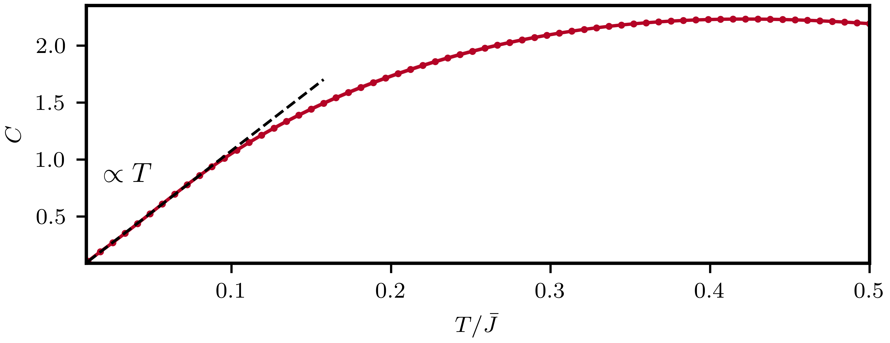

# Specific Heat Random t-J Model

**Author:** Rafael Soares

We use full exact diagonalisation (ED) to calculate the specific heat in the t-J model with $N$ sites, incorporating all-to-all random interactions and hoppings,
$$
\mathcal{H} = \frac{1}{\sqrt{N}}\sum_{i\neq j=0}^{N-1} t_{i j} P c^\dagger_{i\alpha} c_{j\alpha} + \frac{1}{\sqrt{N}} \sum_{i< j=0}^{N-1} J_{ij} \boldsymbol{S}_i \cdot \boldsymbol{S}_j,
$$
where $P$ is the projection on non-doubly occupied sites, $\boldsymbol{S}_i=\frac{1}{2}c^\dagger_{i\alpha} \boldsymbol{\sigma}_{\alpha \beta}c_{j\beta}$ is the spin operator on site $i$. Both the hoppings $t_{ij}=t^\ast_{ji}$ and the exchange interation $J_{ij}$ are independent random numbers with zero mean and variance $\bar{t}^2$ and $\bar{J}^2$, respectively. This type of system exhibits a transition from a spin glass to a disordered Fermi liquid with increasing doping [[1]](#1). Notably, at the critical value of the doping, $p_c \sim1/3$, the model displays features reminiscent of the criticality observed in SYK models.

The following algorithm constructs the t-J Hamiltonian and computes the specific heat using full ED for each realization of the random couplings. The specific heat is then obtained by performing disorder averaging in the post-processing step. In the figure above, we illustrate the case where $\bar{t}^2 = \bar{J}^2$, $N=8$, and the number of fermions with spin-up and spin-down is $2$.


{ align=center }

=== "C++"
	```c++
	--8<-- "examples/specific_heat_randomtj/main.cpp"
	```

=== "Julia"
	```julia
	--8<-- "examples/specific_heat_randomtj/main.jl"
	```
	
## references
<a id="1" href="https://doi.org/10.1103/PhysRevLett.108.240401">[1]</a>
H. Shackleton, A. Wietek, A. Georges, S. Sachdev, Quantum Phase Transition at Nonzero Doping in a Random t-J Model. Phys. Rev. Lett. 126, 136602 (2021)
