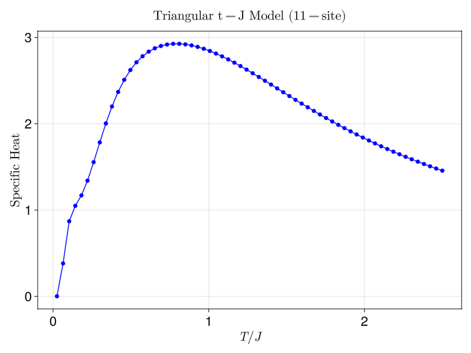

# Specific Heat of the Triangular Lattice t-J Model

**Author** Aritra Sinha

We perform exact diagonalization (ED) to calculate the specific heat \(C\) of the triangular lattice t-J model, defined by the Hamiltonian:

$$
\mathcal{H} = -t \sum_{\langle i,j \rangle, \sigma} P\left(c^\dagger_{i\sigma}c_{j\sigma} + \text{h.c.}\right) + J\sum_{\langle i,j \rangle}\left(\boldsymbol{S}_i\cdot \boldsymbol{S}_j - \frac{1}{4}n_i n_j\right),
$$

where \(P\) is the projection operator onto the space of non-doubly occupied sites, \(c^\dagger_{i\sigma}\) creates an electron at site \(i\) with spin \(\sigma\), and the spin operators are defined as \(\boldsymbol{S}_i=\frac{1}{2} c^\dagger_{i\alpha}\boldsymbol{\sigma}_{\alpha\beta}c_{i\beta}\). The sums \(\langle i,j \rangle\) run over nearest-neighbor bonds on a triangular lattice. This model has been studied extensively due to its relevance for correlated electron systems and frustrated magnetism, particularly in the context of triangular lattice compounds and high-temperature superconductors [[1]](#1).

## Lattice Geometry

In this example, we consider an 11-site triangular lattice (arranged in a 4-4-3 geometry) with one hole in the system. The number of electrons is thus \(N_{\text{sites}} - 1\) (with equal numbers of spin-up and spin-down electrons). 

## Simulation Overview

- **Model Parameters:**  
  - Hopping parameter: \(t = 1.0\)  
  - Spin interaction parameter: \(J = 0.4\)  
- **System Parameters:**  
  - Total lattice sites: \(N_{\text{sites}} = 11\)  
  - Electrons: 10 (5 spin‑up, 5 spin‑down)  
- **Specific Heat Calculation:**  
  For a given temperature \(T\), we compute the Boltzmann weights
  $$
  w_i = \exp\left(-\frac{E_i}{T}\right),
  $$
  where the eigenvalues \(\{E_i\}\) are obtained from exact diagonalization of the t‑J Hamiltonian. The partition function is
  $$
  Z = \sum_i w_i,
  $$
  and the average energy is given by
  $$
  \langle E \rangle = \frac{1}{Z}\sum_i E_i\,w_i.
  $$
  The specific heat is then calculated using the relation
  $$
  C(T) = \frac{1}{T^2}\left(\frac{1}{Z}\sum_i E_i^2\,w_i - \langle E \rangle^2\right).
  $$
   

The figure below shows the specific heat as a function of \(T/J\):

{ align=center }

## Code

=== "Julia"
```julia
--8<-- "examples/specific_heat_tJ_triangular/main.jl"
```

## References

<a id="1" href="https://journals.aps.org/prb/abstract/10.1103/PhysRevB.74.245118">[1]</a>  
J. O. Haerter, M. R. Peterson, and B. S. Shastry, Finite temperature properties of the triangular lattice t-J model, **PRB** **74**, 245118 (2006).
