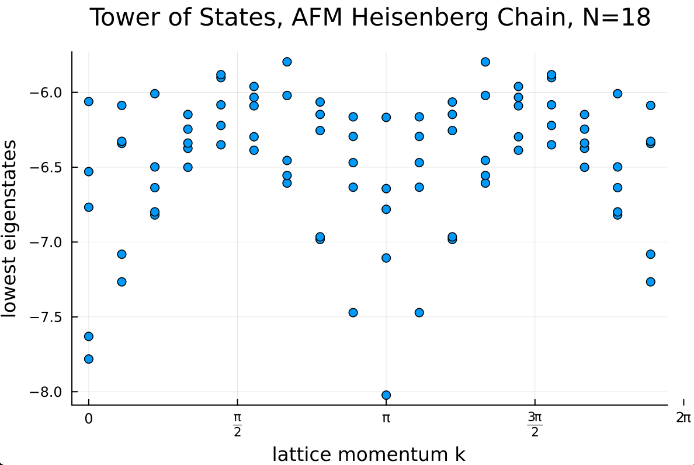

# Lattice Momentum Tower of States for the Heisenberg Chain  

This example demonstrates how to set up a tower of states analysis with respect to translation symmetries using the example of a spin-$1/2$ chain

$$
    H = J \sum_{\langle i, j \rangle} \bm{S}_i \cdot \bm{S}_j,
$$

with periodic boundary conditions and $0 < J$ for ferromagnetic interactions.

The code below demonstrates how the lowest energy levels for each value of the lattice momentum can be computed using the Lanczos algorithm.
The Julia version also contains a simple plotting method, leading to the following tower of states with respect to the lattice momentum.

{ align=center }

As can be seen in the resulting figure, the tower of states nicely captures the dispersion relation of spinon excitations (e.g. flipping one spin relative to the ground state creates two spinons both carrying spin-$1/2$).

This examples also demonstrates that the ground state is not necessarily found in the trivial representation of the translation symmetry, as the ground state resides at lattice momentum $k=\pi$ in the figure. In fact, the ground state alternates between $k=0$ and $k=\pi$ for $N\in 2(2\mathbb{N}+1)$ and $N \in 4 \mathbb{N}$, respectively.


=== "C++"
	```c++
	--8<-- "examples/spinhalf_chain_TOS/main.cpp"
	```

=== "Julia"
	```julia
	--8<-- "examples/spinhalf_chain_TOS/main.jl"
	```