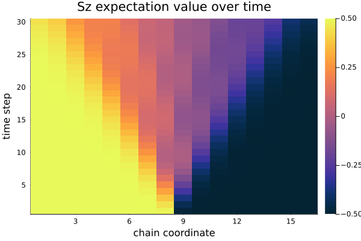

# Domain Wall Dynamics in a Spin-$1/2$ Chain

**Author** Paul Ebert

This example demonstrates the time-evolution of quantum states in `XDiag` for the dynamics of a domain wall in the ferromagnetic spin-$1/2$ XXZ chain

$$
    \mathcal{H} = \sum_{i=1}^{N-1} \Big(- J \bm{S}^z_i \cdot \bm{S}^z_{i+1} + \frac{\Delta}{2}\big( \bm{S}^+_i \cdot \bm{S}^-_{i+1} + \bm{S}^-_i \cdot \bm{S}^+_{i+1} \big) \Big),
$$

where $0 < J$. Note that here we use open instead of periodic boundary conditions, allowing to have a single domain wall in the system.

We choose as initial state the following eigenstate of the associated Ising chain (i.e. the model with only $S^zS^z$ interactions)
$$
\ket{\psi_0} = \ket{\uparrow\ldots\uparrow\downarrow\ldots\downarrow},
$$ 
having a domain wall in the middle of the chain. We expect the exchange terms in the XXZ Hamiltonian above to dissolve the domain wall over time as $\ket{\psi_0}$ is not an eigenstate of the XXZ chain. This process may also be viewed as suddenly turning on exchange interactions in an Ising chain.

The code below demonstrates how the the initial domain wall slowly dissolves. The following figure was created using the Julia version of the code, which includes a plotting command:




=== "C++"
	```c++
	--8<-- "examples/spinhalf_chain_domain_wall_dynamics/main.cpp"
	```

=== "Julia"
	```julia
	--8<-- "examples/spinhalf_chain_domain_wall_dynamics/main.jl"
	```
