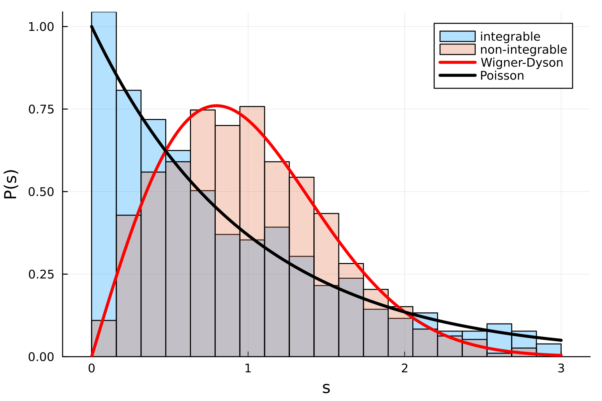

# Level Statistics in Spin-$1/2$ Chains

**Author** Paul Ebert

This example demonstrates the differing level statistics of integrable and non-integrable models using the example of spin-$1/2$ chains.

The term *level statistic* refers to the probability distribution $P(s)$ where the variable $s$ is the difference between adjacent energy levels $0 \leq E_{i+1}-E_i$. That is, for a given quantum system $P(s)$ describes the likelihood that the next excited state above a randomly chosen energy level $E$ has energy $E + s$. To ensure comparability across different systems, one typically normalizes the level spacings by its mean value $\tilde{s} = s/ \bar{s}$ and considers $P(\tilde{s})$.
Since this is the standard procedure, we will assume that $P(s)$ is the distribution of the normalized energy differences below instead of writing $P(\tilde{s})$.

It is well established that for integrable systems (i.e. those with conserved quantities) the level statistic is a Poissonian

$$P_{\mathrm{Poiss}}(s) = \exp(-s)$$

whereas the so-called Wigner-Dyson distribution emerges for non-integrable systems

$$P_{\mathrm{WD}}(s) = \frac{\pi s}{2} \exp(- \pi s^2/4).$$

Intuitively speaking, this is because having a system with symmetries and associated conserved quantities leads to degeneracies that contribute to seeing $s=0$ very often such that $P_{\mathrm{Pois}}(0) > 0$. On the contrary, the energy levels of non-integrable systems are approximately randomly distributed (especially in the bulk of the spectrum), giving a distribution satisfying $P_{\mathrm{WD}}(0) = 0$.

To showcase this, we inspect two spin-$1/2$ Hamiltonians on a chain, one being the integrable XXZ model

$$
    H_{\mathrm{i}} = \sum_{\langle i, j \rangle} \Big(J \bm{S}^z_i \cdot \bm{S}^z_j + \frac{\Delta}{2}\big( \bm{S}^+_i \cdot \bm{S}^-_j + \bm{S}^-_i \cdot \bm{S}^+_j \big) \Big)
$$

while the second merely adds a next-nearest-neighbor interaction

$$
    H_{\mathrm{ni}} = H_{\mathrm{i}} + \sum_{<< i, j >>} J_2 \bm{S}^z_i \cdot \bm{S}^z_j
$$

and becomes "non-integrable". We must put "non-integrable" in quotes here, since strictly speaking both models are integrable. However, the $H_{\mathrm{ni}}$ system becomes non-integrable once the trivial spin-flip, mirror, and translation symmetries (we employ periodic boundary conditions) are removed. This is done by considering specific sectors of the total Hilbert space which is easily done in `XDiag`.

The code below demonstrates how the level statistics of these systems can be computed inside the sectors where all trivial symmetries are removed.
The Julia version also contains a simple plotting method, leading to the following distribution of level statistics:

{ align=center }


=== "C++"
	```c++
	--8<-- "examples/spinhalf_chain_level_statistics/main.cpp"
	```

=== "Julia"
	```julia
	--8<-- "examples/spinhalf_chain_level_statistics/main.jl"
	```
