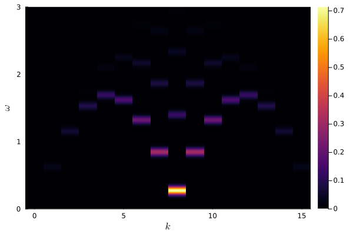

# Dynamical spin structure factor

**Author** Martin Ulaga

Uses the [Lanczos algorithm](../documentation/algorithms/eigvals_lanczos.md) [[1]](#1) to calculate the dynamical spin spectral function of the spin-1/2 Heisenberg chain. The structure factor is defined as

$$
    S^{zz}({\bf k},\omega) = \int dt e^{-i\omega t}\langle S^z_{\bf k}(t)S^z_{\bf -k}\rangle,
$$
where $S^z_{\bf k}=\frac{1}{\sqrt{N}}\sum_i e^{-i\bf{k\cdot r}_i}S^z_i$ and $S^z_i$ is a spin operator on site $i$. The calculation is done using the Lehmann representation

$$
    S^{zz}({\bf k},\omega)=\frac{1}{N}\sum_{m=1}^M |\langle\Psi_0|S^z_{\bf k}|\psi_m\rangle|^2\delta(\omega-\epsilon_m+E_0),
$$
where $|\Psi_0\rangle$ is the ground state which needs to be computed. The algorithm proceeds in 3 steps:

1. Compute the ground state $|\Psi_0\rangle$ (is the appropriate symmetry sector, e.g., usually ${\bf k}=0$).

2. Find the operator $S^z_{\bf k}$, e.g. symmetrize with respect to the appropriate irrep, and calculate $|\tilde{\Psi}_0\rangle=S^z_{\bf k}|\Psi_0\rangle$.

3. Rerun the Lanczos algorigthm using the ***normalized*** state $|\Psi_1\rangle=|\tilde{\Psi}_0\rangle/\sqrt{\langle\tilde{\Psi}_0|\tilde{\Psi}_0\rangle}$.

{ align=center }

## Main example code

=== "Julia"

    ```julia
        --8<-- "examples/spinhalf_chain_structure_factor/main.jl"
    ```

=== "C++"

    ```c++
        --8<-- "examples/spinhalf_chain_structure_factor/main.cpp"
    ```

## Visualization script

Postprocessing is here split into two parts:

1. Compute the poles/weights of the spectral function. The $m$-th pole appears at frequency $\omega = \epsilon_m -E_0$ with the associated weights given by the norm of $|\tilde{\Psi}_0\rangle$ and the projection $w_m=\langle \tilde{\Psi}_1|\psi_m\rangle$. The latter is obtained from the first eigenvector of the tridiagonal matrix.

2. Spread out the poles and weights using a Gaussian kernel of width $\eta$ onto some frequency interval, artificially broadening the $\delta$-functions.

=== "Julia"

    ```julia
       --8<-- "examples/spinhalf_chain_structure_factor/plot.jl"
    ```

## references
<a id="1">[1]</a> 
Prelovšek, P., & Bonča, J. (2013). Ground state and finite temperature Lanczos methods. Strongly Correlated Systems: Numerical Methods, 1-30.
