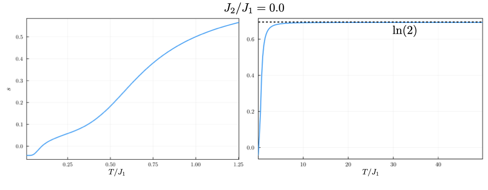

# Square lattice $J_1-J_2$ model Wilson ratio

In this example, we compute varios thermodynamic quantities of the Square lattice $J_1-J2$ model including susceptibility, entropy, and Wilson ratio.

The $J_1-J2$ model on a square lattice consists of Heisenberg couplings between nearest neighbors and next nearest neighbors with coupling constants $J_1$ and $J_2$, respectively. The Hamiltonian has the form

$$
\mathcal{H} = J_1 \sum_{\langle i,j \rangle} \boldsymbol{S}_i \cdot \boldsymbol{S}_j + J_2 \sum_{\langle\langle i,j \rangle\rangle} \boldsymbol{S}_i \cdot \boldsymbol{S}_j.
$$

The spectrum of this model for a $C_4$ symmetric $N=32$ site system is shown below

{ align=center }

For small values of $J_2/J_1$, the ground state of this model has Néel order, whereas for large values of $J_2/J_1$, the ground state has stripe order [[2]](#2).

The following code was used to obtain the spectrum

=== "C++"
	```c++
	--8<-- "examples/square-J1-J2/main.cpp"
	```
The interactions terms and the symmetry representation inputs are given in the following TOML file:

=== "toml"
	```toml
	--8<-- "examples/square-J1-J2/square.32.J1.fsl.pbc.toml"
	```
To run the above C++ code with the toml file, one needs to execute the following command 

``` bash
./build/main n_sites n_up kname J1 J2 seed
```
where the n_sites, n_up, kname, J1, and seed are to be replaced by their values such as 32, 16, Gamma.C4.A, 1.00, 0.1, 1, respectively. Once the code has been run for various values of $J_2/J_1$, the spectrum can be immediately plotted from the eigenvalues saved in the .h5 files.


The expectation value of an observable $\mathcal{O}$ in the canonical ensemble is

$$
\langle \mathcal{O} \rangle = \frac{\text{Tr}\left(e^{-\beta \mathcal{H}} \mathcal{O}\right)}{\mathcal{Z}},
$$


where $\beta$ is the inverse temperature and $\mathcal{Z} = \text{Tr}\left(e^{-\beta \mathcal{H}}\right)$. We approximate the trace stochastically using a set of $R$ random vectors $|r\rangle$, leading to

$$
\langle \mathcal{O} \rangle \approx \frac{N_{st}}{ZR}\sum_{r=1}^R\sum_{j=0}^M e^{-\beta\epsilon_j^r}\langle r|\psi_j^r\rangle \langle \psi_j^r|\mathcal{O}|r\rangle,
$$

and 

$$
Z \approx \frac{N_{st}}{ZR}\sum_{r=1}^R\sum_{j=0}^M e^{-\beta\epsilon_j^r}|\langle r|\psi_j^r\rangle|^2
$$

where $|r\rangle$ seves as intial vectors for the Lanczos iteration, resulting in $M$ eigenvalues $\epsilon_j^r$ with corresponding $|\psi_j^r\rangle$ [[3]](#3), and $N_{st}$ is the total number of many-body states in the Hilbert space. Once the Lanczos basis $V$ and the $M\times M$ tridiagonal matrix  $T = V^\dagger \mathcal{H} V$ is constructed from $|r\rangle$, $\langle r|\psi_j^r \rangle$ is just the first component of the $j$-th eigenvector of $T$.

Thus, for each random state, the algorithm performs the following steps:

1. **Generate the Lanczos Basis:** Obtain the elements of the tridiagonal matrix $T$ from the state $|r\rangle$.

2. **Compute thermodynamic quantities:** To obtain the specific heat, 
$$
   C = \beta^2\left[\langle \mathcal{H}^2 \rangle - \langle \mathcal{H} \rangle^2\right],
$$
we need to evaluate

$$
   \langle \mathcal{H} \rangle \approx \frac{N_{st}}{ZR}\sum_{r=1}^R\sum_{j=0}^M e^{-\beta\epsilon_j^r}|\langle r|\psi_j^r\rangle|^2 \epsilon_j^r, \\[2exm]
    \langle \mathcal{H}^2 \rangle \approx \frac{N_{st}}{ZR}\sum_{r=1}^R\sum_{j=0}^M e^{-\beta\epsilon_j^r}|\langle r|\psi_j^r\rangle|^2 (\epsilon_j^r)^2.
$$

This part could be done in the post-processing. Similarly, one can obtain magnetic susceptibility 
$$
   \chi = \frac{1}{N}\beta\left[\langle (S_z)^2 \rangle - \langle S_z \rangle^2\right],
$$
where $N$ is the number of sites, by computing

$$
   \langle S_z \rangle \approx \frac{N_{st}}{ZR}\sum_{r=1}^R\sum_{j=0}^M e^{-\beta\epsilon_j^r}|\langle r|\psi_j^r\rangle|^2 S_z, \\[2exm]
    \langle S_z^2 \rangle \approx \frac{N_{st}}{ZR}\sum_{r=1}^R\sum_{j=0}^M e^{-\beta\epsilon_j^r}|\langle r|\psi_j^r\rangle|^2 (S_z)^2.
$$

Note that above we used $\langle \psi_j^r|S_z|r\rangle = \langle \psi_j^r|r\rangle S_z$ because our Hamiltonian is $S_z$ symmetric, and we use Lanczos algorithm per $S_z$ sector.

Finally, from the partition function and $\langle\mathcal{H}\rangle$, one can directly compute entropy using the formula

$$
s = \frac{1}{N}(\log(Z)+\beta\langle(\mathcal{H}-E_0)\rangle),
$$

where $N$ is the number of sites and $E_0$ is the ground state energy. A typical plot of entropy as a funtion of temperature is shown in the figure below

The two subfigures are plotted to show typical behaviors at low and high temperatures. The subplot on the right shows that high temperture entropy satuarates to $s_{T\rightarrow \infty} =\ln(2)$. The subplot on the left shows that for very low temperature, entropy value obtained using the method mentioned above can be negative [[4]](#4).

Once we obtain magnetic susceptibility and entropy, we can also plot the Wilson ratio [[5]](#5)
$$
R(T) = \frac{4\pi^2 T \chi(T)}{3s(T)}.
$$
For antiferromagnets the effective magnon excitations lead to $s\propto T^2$ for low $T$, and $\chi(T\rightarrow)>0$ due to contribution of the spin fluctuations transverse to the the magnetic order; hence $R(T\rightarrow 0) \rightarrow \infty$. Below we show the plot of Wilson ration vs. temperature for several values of $J_2/J_1$

Note that each curve is cut off on the left at some $T$. This is because one can expect that results reach the $N\rightarrow \infty$ validity only for $Z>Z^*\gg 1$. In reality we set of cut-off of $Z^* = 10$, and only plot data for temperatures at which $Z>10$ [[5]](#5). However, even with this cutoff, we can see that for small (Néel antiferromagnet) and large (stripe antiferromagnet) $J_2/J_1$, the Wilson ratio curve goes upward as temperature is lowered for small $T$.

All the thermodynamic quantities mentioned above can be plotted using the Julia script below

=== "Julia"
	```julia
	--8<-- "examples/square-J1-J2/plot-therm.jl"
	```
## References
<a id="1" href="https://doi.org/10.1103/PhysRevLett.108.240401">[1]</a>
S. Sugiura and A. Shimizu, Thermal Pure Quantum States at Finite Temperature, Phys. Rev. Lett. 108, 240401 (2012).

<a id="2" href="https://journals.aps.org/prresearch/abstract/10.1103/PhysRevResearch.1.033038">[2]</a>
Zhang, X. T., Huang, Y., Wu, H. Q., Sheng, D. N., and Gong, S. S. Physical Review B, 109(12), 125146 (2024).

<a id="3" href="https://link.springer.com/chapter/10.1007/978-3-642-35106-8_1">[3]</a>
Prelovšek, P., and J. Bonča. "Ground state and finite temperature Lanczos methods." Strongly Correlated Systems: Numerical Methods (2013): 1-30.


<a id="4" href="https://journals.aps.org/prresearch/pdf/10.1103/PhysRevResearch.2.013205">[4]</a>
Morita, Katsuhiro, and Takami Tohyama. "Finite-temperature properties of the Kitaev-Heisenberg models on kagome and triangular lattices studied by improved finite-temperature Lanczos methods." Phys. Rev. Res. 2, 013205 (2020).

<a id="5" href="https://journals.aps.org/prresearch/abstract/10.1103/PhysRevResearch.2.023024">[5]</a>
Prelovšek, P., K. Morita, T. Tohyama, and J. Herbrych. "Vanishing Wilson ratio as the hallmark of quantum spin-liquid models." Phys. Rev. Res. 2, no. 2 (2020): 023024.