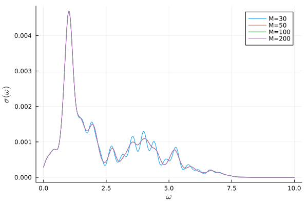

# Optical conductivity $t$-$J$ model

**Author** Martin Ulaga

Uses the [Lanczos algorithm](../documentation/algorithms/eigvals_lanczos.md)[[1]](#1) to calculate the conductivity of the planar $t$-$J$ model with one hole. See also the documentation page for the [spin structure factor](spinhalf_chain_structure_factor.md). The ground state conductivity is geven by the current autocorrelator

$$
    T\sigma(\omega)=-i\int dt e^{-i\omega t}\langle  J(t)J\rangle.
$$

The plotting script includes a simple benchmark exploring the role of the number of Lanczos iterations on the result.

{ align=center }

## Example code

=== "Julia"

    ```julia
        --8<-- "examples/tJ_conductivity/main.jl"
    ```

=== "C++"

    ```c++
        --8<-- "examples/tJ_conductivity/main.cpp"
    ```

## Plotting script

=== "Julia"

    ```julia
        --8<-- "examples/tJ_conductivity/plot.jl"
    ```

## References
<a id="1">[1]</a> 
Prelovšek, P., & Bonča, J. (2013). Ground state and finite temperature Lanczos methods. Strongly Correlated Systems: Numerical Methods, 1-30.
