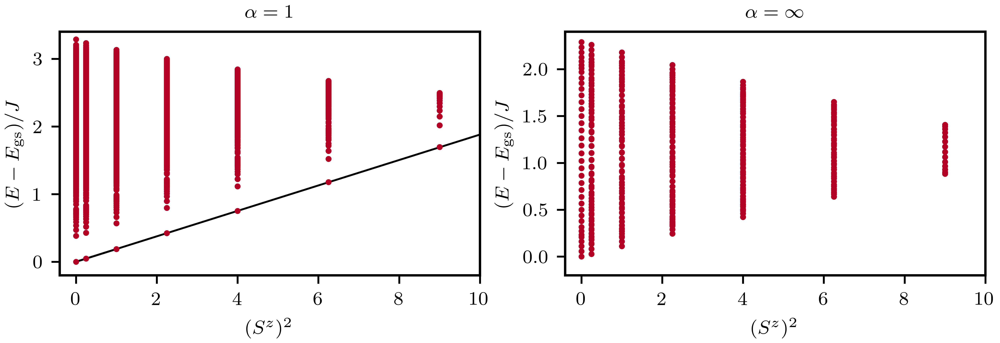

# Tower Of States $\alpha \text{XX}$ model

**Author** Rafael Soares

We perform a tower of states (TOS) analizes [[1]](#1) of the $\alpha \text{XX}$ model [[2]](#2). This model consists of an array of $N$ spin-$\frac{1}{2}$ sites with long-range $\text{XY}$  couplings that decay as a power law with exponent $\alpha$,
$$
    \mathcal{H} = -\dfrac{J}{2} \sum_{i<j} \dfrac{S^+_iS^-_j+S^-_iS^+_j}{|i - j|^\alpha}.
$$

The TOS analysis provides strong evidence for spontaneous symmetry breaking (SSB) in the thermodynamic limit, as the ground state of a finite system is completely symmetric. The spectrum of the $\alpha \text{XX}$ model can be labeled by total magnetization since $\left[\mathcal{H}, S^z \right]=0$. 

To perform the TOS analysis, we gather the eigenvalues using either full exact diagonalization (ED) or the Lanczos algorithm in each symmetry sector.

{ align=center }

In the figure above for $\alpha=1$, the lowest energy in each $S^z$ sector clear forms a tower of states. These energies scale as $\propto 1 / N$, so in the thermodynamic limit there the collapse of the tower of states forming a highly degenerate ground state manifold [[3]](#3). As such, in the thermodynamic limit SSB occurs. In contrast, for a finite system the ground state always lies in $S^z=0$, and so it is symemtric (it is also an eigenstate of the Hamiltonian's symmetry). 

SSB does not occur for all values of $\alpha$. For example, when $\alpha \rightarrow +\infty$, the system becomes a one-dimensional $\text{XX}$ spin chain with only short-range interactions. In this case, the ground state is always in the $S^z=0$ sector.

=== "C++"
	```c++
	--8<-- "examples/tos_alpha_xx/main.cpp"
	```

=== "Julia"
	```julia
	--8<-- "examples/tos_alpha_xx/main.jl"
	```
	
## references
<a id="1" href="https://journals.aps.org/pr/abstract/10.1103/PhysRev.86.694">[1]</a>
P. W. Anderson, An Approximate Quantum Theory of the Antiferromagnetic Ground State, Phys. Rev. 86, 694 (1952)

<a id="2" href="https://journals.aps.org/pra/abstract/10.1103/PhysRevA.105.022625">[2]</a>
Tommaso Comparin, Fabio Mezzacapo and Tommaso Roscilde, Robust spin squeezing from the tower of states of U(1)-symmetric spin Hamiltonians, Phys. Rev. A 105, 02262 (2022)

<a id="3" href="https://arxiv.org/abs/1704.08622">[3]</a>
Alexander Wietek, Michael Schuler and Andreas M. Läuchli, Studying Continuous Symmetry Breaking using Energy Level Spectroscopy, arXiv:1704.08622 (2017).
