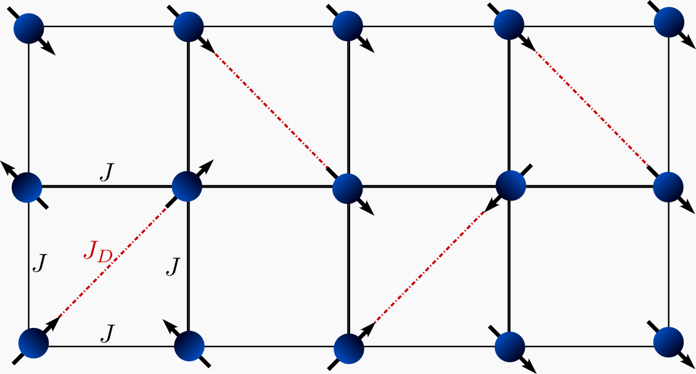

# Shastry Sutherland Specific Heat with TPQ

**Author** Rafael Soares

We use an ensemble of Thermal Pure Quantum (TPQ) states [[1]](#1) to compute the total energy and specific heat as functions of temperature for the Shastry–Sutherland model.

The Shastry–Sutherland model is a paradigmatic example of a frustrated two-dimensional antiferromagnetic spin system. It is widely used as a faithful representation of materials such as the frustrated quantum magnet $\text{SrCu}_2(\text{BO}_3)_2$. On a square lattice, the model describes spin $-\frac{1}{2}$ magnetic moments interacting via Heisenberg antiferromagnetic couplings, as shown in following figure. 

{ align=center }

The Hamiltonian is given by

$$
\mathcal{H} = J \sum_{\langle i,j \rangle} \boldsymbol{S}_i \cdot \boldsymbol{S}_j + J_D \sum_{\langle\langle i,j \rangle\rangle} \boldsymbol{S}_i \cdot \boldsymbol{S}_j.
$$

The expectation value of an observable $\mathcal{O}$ in the canonical ensemble is

$$
\langle \mathcal{O} \rangle = \frac{\text{Tr}\left(e^{-\beta \mathcal{H}} \mathcal{O}\right)}{\mathcal{Z}},
$$

where $\beta$ is the inverse temperature and $\mathcal{Z} = \text{Tr}\left(e^{-\beta \mathcal{H}}\right)$. We approximate the trace stochastically using a set of random vectors $\{r_\alpha\}$, leading to

$$
\langle \mathcal{O} \rangle \approx \sum_{\alpha} \frac{\langle \beta_\alpha | \mathcal{O} | \beta_\alpha \rangle}{\langle \beta_\alpha | \beta_\alpha \rangle}, \quad \text{with } |\beta_\alpha\rangle = e^{-\beta \mathcal{H}}|r_\alpha\rangle,
$$
where $ |\beta_\alpha\rangle$ is a TPQ state.

We efficiently compute the TPQ state using the Lanczos basis [[2]](#2), $V$, constructed from $|r_\alpha\rangle$. In this basis, the observable is approximated as

$$
\langle \beta_\alpha | \mathcal{O} | \beta_\alpha \rangle \approx e_1^T\, V\, e^{-\beta/2\, T}\, V^\dagger\, \mathcal{O}\, V\, e^{-\beta/2\, T}\, V^\dagger\, e_1,
$$

where $e_1^T = (1, 0, \dots, 0)$ and $T = V^\dagger \mathcal{H} V$ is a tridiagonal matrix.

Thus, for each random state, the algorithm performs the following steps:

1. **Generate the Lanczos Basis:** Obtain the elements of the tridiagonal matrix $T$ from the state $|r_\alpha\rangle$.

2. **Compute Observables:** To obtain the specific heat, 
$$
   C = \beta^2\left[\langle \mathcal{H}^2 \rangle - \langle \mathcal{H} \rangle^2\right],
$$
we need to evaluate

$$
   \langle \beta_\alpha | \mathcal{H} | \beta_\alpha \rangle \approx e_1^T\, V\, e^{-\beta/2\, T}\, T\, e^{-\beta/2\, T}\, V^\dagger\, e_1, \\[2exm]
    \langle \beta_\alpha | \mathcal{H}^2 | \beta_\alpha \rangle \approx e_1^T\, V\, e^{-\beta/2\, T}\, T^2\, e^{-\beta/2\, T}\, V^\dagger\, e_1.
$$

This part could be done in the post-processing. The result is shown in the following figure,
{ align=center }
The error bar was done using a Jackknife analysis.
=== "C++"
	```c++
	--8<-- "examples/tpq_shastry_sutherland/main.cpp"
	```

=== "Julia"
	```julia
	--8<-- "examples/tpq_shastry_sutherland/main.jl"
	```

The interactions terms for the Shastry Sutherland model with $L=5$ and $W=4$ sites is given in the following TOML file:
=== "toml"
	```toml
	--8<-- "examples/tpq_shastry_sutherland/shastry_sutherland_L_5_W_4.toml"
	```

## References
<a id="1" href="https://doi.org/10.1103/PhysRevLett.108.240401">[1]</a>
S. Sugiura and A. Shimizu, Thermal Pure Quantum States at Finite Temperature, Phys. Rev. Lett. 108, 240401 (2012).

<a id="2" href="https://journals.aps.org/prresearch/abstract/10.1103/PhysRevResearch.1.033038">[2]</a>
Wietek, Alexander, Corboz, Philippe, Wessel, Stefan, Normand, B., Mila, Fr\'ed\'eric and Honecker, Andreas Thermodynamic properties of the Shastry-Sutherland model throughout the dimer-product phase, PhysRevResearch.103, 3038 (2019).
